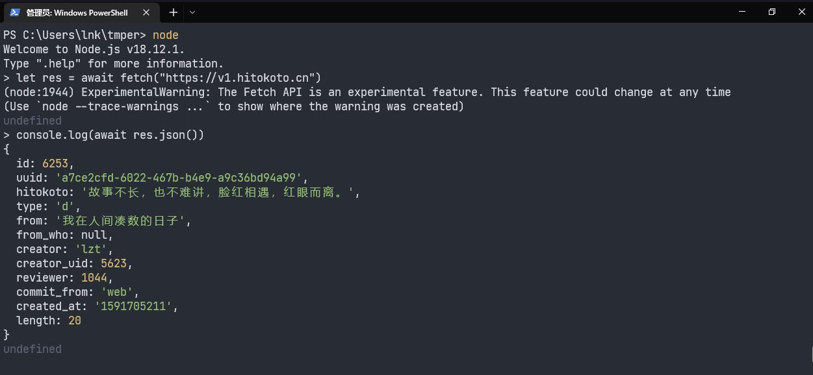

# Node.js 以及 npm 的安装与使用

Node.js 是目前最受欢迎、使用最广的 JavaScript 服务端运行时，可以让 JavaScript 用于编写后端。

npm 是 Node.js 附带的包管理器。

类比于 Python 的解释器和 pip。

虽然我们学的是前端，但也要用到 Node.js 的一点知识，享受 JavaScript 生态。

[[toc]]

## Node.js 的安装

先安装上再说。

### Windows 平台

应该大部分都是 Windows。

#### 如何校验安装成功

安装完后打开命令提示符或 PowerShell 输入以下命令检查 Node.js 是否安装成功。

```powershell
node --version
```

若安装成功，应该打印出版本号。


#### 方法 1：官网下载安装包直接安装

最简单。

访问[官网](https://nodejs.org/en/)，下载 LTS（长期支持）版本。个人推荐 v16 版本。


安装时保持默认选项即可，

#### 方法 2: 通过 Windows 的软件包管理器 scoop 安装（推荐）

访问 [scoop 官网](https://scoop.sh/)，按照官网提示操作安装 scoop：

打开 PowerShell

```powershell
Set-ExecutionPolicy RemoteSigned -Scope CurrentUser # Optional: Needed to run a remote script the first time
irm get.scoop.sh | iex
```

使用 scoop 安装 Node.js：

```powershell
scoop install nodejs-lts
```

后续培训会用到的 git 等工具，也可以直接用 scoop 安装，比较方便

#### 方法 3：使用 Node.js 版本管理器

不同版本的 Node.js 提供的 API 可能略有不同，有些情况下需要我们在不同版本的 Node.js 切换，这时有一个版本管理器会比较方便。

这里推荐的版本管理器是 fnm， 可以去[官网](https://github.com/Schniz/fnm)下载或者使用方法 2 中提到的 scoop 安装。

使用 fnm 安装 Node.js:

```powershell
fnm env --use-on-cd | Out-String | Invoke-Expression # 初始化 fnm 的环境，可以加到 PowerShell 的 profile 里自动执行
fnm install v18.12.1
```

### macOS 平台

不多赘述，有需求请自行联系管理员。

### Linux 平台

使用 Linux 的同学应该有能力自行完成安装和配置，否则，请换回 Windows。

### 其它

同上。

## 简单使用

终端（cmd、PowerShell etc.）里键入 `node` 命令并回车，进入 Node.js 的交互式环境。

类似浏览器开发者工具里的终端，但没有和网页、浏览器相关的 API。


读取文件的简单例子：


发送网络请求（没有跨域限制）：




更多内容可以看官网的[文档](https://nodejs.org/dist/latest-v18.x/docs/api/)

## npm

npm 是 Node.js 的默认包管理器，其它常见的包管理器有 yarn、pnpm 等。

个人不推荐使用 npm，但一定要会用。

装完 Node.js 自带 npm

和 python 的 virtualenv 不同，npm 会把当前项目所有依赖管理在项目根目录的
`node_modules/` 文件夹下，并将依赖信息和其它项目相关信息记录在 `package.json`
文件里，有 `package.json` 文件的目录可视为 Node.js 项目的根目录。

进入一个新文件夹，运行以下命令：

```bash
npm init
```

会根据用户的输入基于当前目录初始化项目，生成基本的信息在 `package.json` 里。

```json
{
  "name": "new-project",
  "version": "1.0.0",
  "description": "",
  "main": "index.js",
  "script": {
    "test": "echo \"Error: no test specified\" && exit 1 "
  },
  "author": "",
  "license": ""
}
```

`package.json` 大概长这个样子。

:::warning

以下命令均需在项目根目录下运行

:::

`npm install` 命令可以安装依赖：

```bash
npm install axios
```

安装完后，可以写一下测试代码：

```javascript
// index.js

const axios = require('axios');

axios.get('https://baidu.com').then(res => {
  console.log(res.data);
});
```

执行一下：

```bash
node ./index.js
```

ES6 Module 形式：

```javascript
// index.mjs

import axios from 'axios';

console.log((await axios.get('https://lnkkerst.me')).data);
```

执行一下：

```bash
node ./index.mjs
```

更多内容可以看[官方文档](https://docs.npmjs.com/)。

npm 的仓库：<https://www.npmjs.com/>
