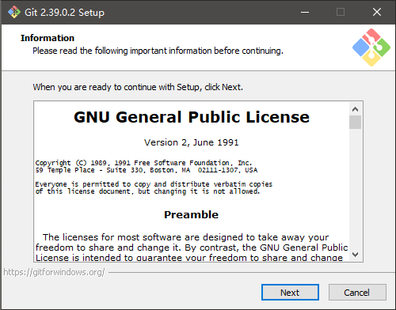
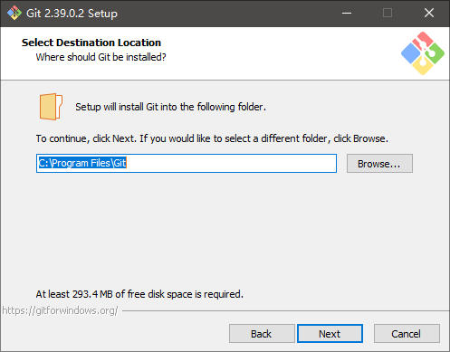
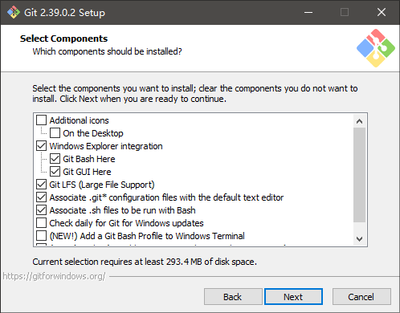
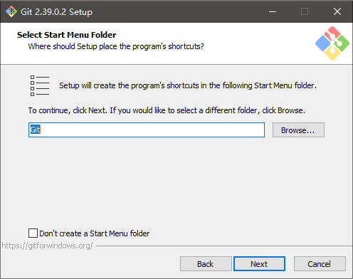
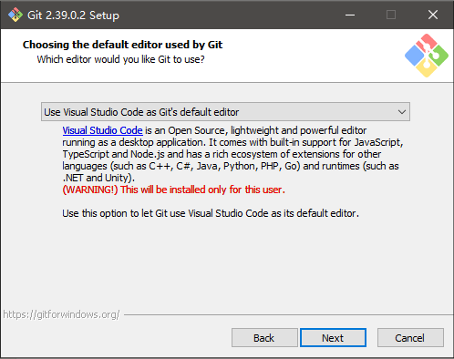
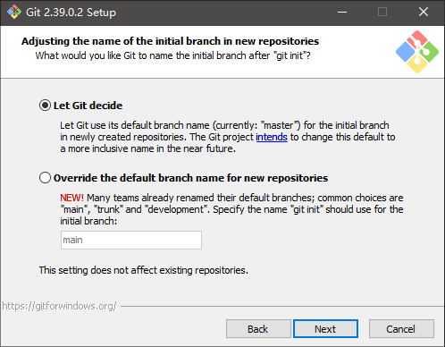

# Git 的安装

[[toc]]

## 如何检验安装成功

打开 cmd 或者 PowerShell 或者 bash（Windows 下装 git 附带），输入：

```bash
git --version
```

如果出现类似 `git version 2.39.0` 的输出就（大概）算安装成功。

## Windows 平台

### 通过 Scoop 安装(推荐，但应该需要科学上网)

```powershell
scoop install git
```

### 通过安装包安装

安装包可以在[官网](https://git-scm.com/downloads)下载。访问官网困难的可以点[这里](/slides/onlinetek-train-2022/notes/git/Git-2.39.0.2-64-bit.exe)下载。



点 Next。



安装路径，建议保持默认。



看不懂的话保持默认就行。



点 Next。



不知道选什么的话就按图上的来。



看不懂就保持默认。

后面的选项都是，看不懂就保持默认。

## macOS 平台

真有的话可以群里踢我。

## Linux 平台

自行解决

## 其它平台

同上

## 其它

注册一个 [GitHub](https://github.com/) 或者 [Gitee](https://gitee.com/) 的账号。

学习资料：

- 《Pro Git》
  - [在线阅读](https://git-scm.com/book/zh/v2)
  - [中文 pdf 下载](/git/progit.pdf)
  - [中文 epub 下载](/git/progit.epub)
