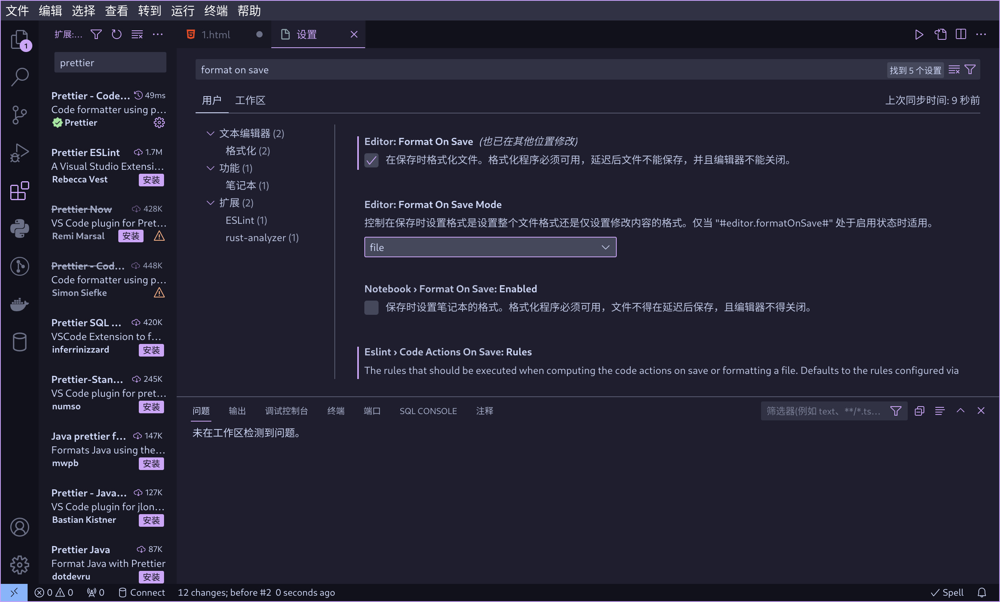

# 试用期第一次课补充内容

[[toc]]

上课时可能忘记了的一些东西。

## 推荐阅读的去年的文章

- [如何解决疑难杂症](/2022/misc/how-to-solve-problems)
- [2022 ch01-补充内容](/2022/trial/ch01-additional-content)

## 一些推荐的插件

HTMLHint，能用来检查错误。


## vscode 一些技巧

按下 `CTRL+Shift+P`，能打开 vscode 的命令面板，在里面能搜到几乎所有操作。

### 格式化代码

良好的代码缩进可以有效的保护示例，减少 debug 难度。

良好的代码缩进：

```html
<div>
  
  <div>
    <div class="username">
      <span class="username-text">lnk</span>
      <span class="username-role">普通会员</span>
    </div>
    <div class="slogan">这个家伙很懒，什么也没留下。</div>
  </div>
</div>
```

糟糕的代码缩进：

```
<div> 
  <div>
  <div class="username"> <span class="username-text">lnk</span>
    <span class="username-role">普通会员</span>
  </div>
    <div class="slogan">这个家伙很懒，什么也没留下。</div>
</div>
</div>
```

手动保持缩进太麻烦了怎么办？没关系，我们有代码格式化。

代码格式化（format）意思就是把你的代码变成缩进好了的，漂漂亮亮的格式。

vscode 内置了对 HTML 代码格式化的功能，按 `CTRL+Shift+P` 打开命令面板，搜索 "format"：


选择格式化文档，然后选择一种格式化工具即可，vscode 内置了 HTML 的格式化工具。

也可以尝试使用 [Pretter](https://marketplace.visualstudio.com/items?itemName=esbenp.prettier-vscode) 作为格式化工具，具有一定的可配置能力。

手动格式化太麻烦了？我们可以配置保存文件时候自动格式化代码。

点击 vscode 左下角的齿轮图标，进入设置页面，搜索 "format on save"：



更进一步，可以打开自动保存，不用自己动手点保存了：


