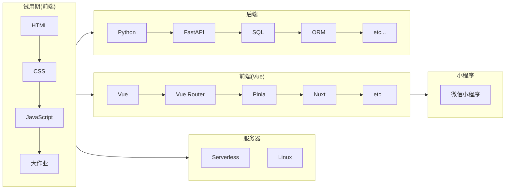
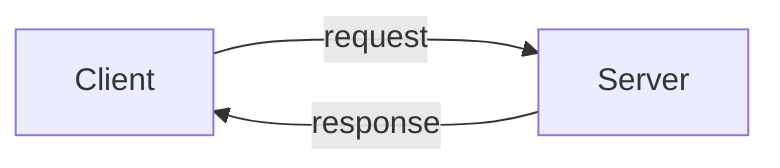

# Intro & HTML

---

# Overview
目录

<Toc :maxDepth="1" />

---
layout: center
---

# 绪论

---

## 我们要学什么

Web 开发技术

<v-click>

### 前端

- 网页
- 小程序
- 其他

</v-click>

<v-click>

- 移动端(quasar, maybe)
- 桌面端(electron, maybe)
- 服务器/Serverless

</v-click>

<br/>

<v-click>

### 后端

- Python(FastAPI)
- 数据库(SQL, ORM)
- Linux服务器运维

<v-click>

- Node.js(express, maybe)

</v-click>

</v-click>

---

## Roadmap

<div mt="4"></div>

<v-click>


</v-click>

---

## 培训安排

<br/>

- 试用期四周每周周六或周日安排一节课(2h)，有简单作业，可以当天完成
- 试用期结束提交大作业（10.29 之前），通过的为正式成员
- 正式成员进行前后端分流

<br/>

<v-click>

- 课上内容以路线以及常用知识点为主
- 锻炼自学能力：寻找和阅读资料的能力
- 大作业不难，能否通过取决于大家态度

</v-click>

---

## 学习资料

<br/>

<div class="grid grid-cols-2">

<div>

### 图文

<br/>

- [MDN Web Docs](https://developer.mozilla.org/en-US/)(文档，推荐英文版，中文翻译由社区维护)
- [W3C](https://www.w3.org/)(权威标准)
- [WangDoc](https://wangdoc.com/)(html, js 教程，建议当文档来看)
- [廖雪峰](https://www.liaoxuefeng.com/)(教程，适合有点编程基础)
- [阮一峰的网络日志](https://www.ruanyifeng.com/blog/)(博客，零碎知识点和技巧)
- [酷壳Coolshell](https://www.coolshell.cn/)(可能永远停更了，祝愿作者一生平安)
- [RUNOOB](https://www.runoob.com/)(简洁可以速查，里面有个菜鸟工具还蛮好用的，还有一些“小测验”)
- [W3Cschool](https://www.w3cschool.cn/tutorial)(东西似乎比菜鸟多一点，当文档用)
- [W3schools](https://www.w3schools.cn/)(也差不多的内容吧)
- ... 待补充

</div>

<div class="">

<div>

### 视频

- [bilibili](https://www.bilibili.com/)(黑马程序员、尚硅谷)
- [MOOC](https://www.icourse163.org/)(北方工业大学的小程序，北理工的 Python)

</div>

<div class="mt-12">

### 社区

- 学线 Web(
- [GitHub](https://github.com/)(代码托管平台，兼有社区等功能，如各个项目的discussion板块)
- [StackOverflow](https://stackoverflow.com/)(找答案，提问题)
- [稀土掘金](https://juejin.cn/)(国内技术平台，前端为主)
- [思否](https://segmentfault.com/)(国内技术平台，提问，互联网行业为主)
- 其他平台如知乎、CSDN（前者可能质量还略高）
- 不存在的平台

</div>

</div>

</div>

---

## 基本工具

<div class="mt-12 grid grid-cols-3">

<div>

### 浏览器 Browsers

- Chrome(必需)
- Microsoft Edge
- Firefox
- Safari
- Opera, Brave, Vivaldi
- Internet Explorer, Netscape Navigator (元老级浏览器，早已弃用)
- Android Webview
- etc.

</div>

<div>

### IDE & 编辑器

- Notepad
- Visual Studio Code
- JetBrains WebStorm, PyCharm, etc.
- Nano, Vim, Emacs, etc. 

</div>

<div>

### 其它

- http server
  - `python -m http.server`
  - IIS
  - Nginx and many more
  - etc.
- 版本控制系统(Git)

</div>

</div>

---

## 基本概念

<br />

### 文件、文件夹、路径

- 你的硬盘里有一堆文件/文件夹
- 文件夹可以包含文件或文件夹
- 文件夹可嵌套、有一定限制
- 通过“路径”可以描述一个文件的位置。
- 路径分为绝对路径和相对路径，相对路径又涉及到当前“工作目录”的概念
- 路径的表示，使用`/`符号（在Windows下是`\`，但是也兼容`/`，因此统一用`/`）分隔每层文件夹
- 文件是一堆二进制 $01$，我们可以用不同的方式去对待它

<br />

### URL

Uniform Resource Locators(统一资源定位符)。我们常说的网址就是一种HRL。

<v-click>
<UrlExample />
</v-click>

---

## 前端三件套

HTML, CSS, JavaScript

### HTML

HTML（HyperText Markup Language，超文本标记语言），用来描述网页结构和内容，比如一个段落、一个图片、一张数据表。

### CSS

CSS（Cascading Style Sheets，层叠样式表）用于为网页添加样式，比如把某段文字加粗，某个词语加上下划线，把某张图片固定在页面最顶端显示。

### JavaScript

JavaScript 是一门真正的编程语言，可以为网站添加交互功能，比如按下某个按钮发送报名申请，鼠标划过图片会有动态特效，比如做一个游戏。

---
layout: two-cols
---

## 组织网站的文件

<br/>

- 我们的网站项目现阶段也是由一堆文件构成的
- 用路径可以描述一个文件的位置
- 路径分为**绝对路径**和**相对路径**
<!--
- 文件名分为前缀名和后缀名
-->
- 文件名通常会包括主名和扩展名（也称为后缀名），后者约定俗成地作为文件类型的**标识**（尤其是在Windows系统下）
- 我们的网站结构可以参考右图

<div class="mt-4"></div>

### 常见扩展名

- 图片: jpg, png, bmp, gif, ico, webp, ...
- 视频: mp4, mkv, avi, webm, ...
- 音频: mp3, wav, flac, ...
- HTML: html
- CSS: css
- JavaScript: js

::right::

<div mt="16"></div>

```bash
my-first-project
├── index.html
├── scripts
│  └── index.js
├── styles
│  └── index.css
└── images
   └── cat.gif
```

---

## 发布我的网站

<br />

### 互联网如何工作

<br />



背后的细节可以开一个学院。

> OSI模型、协议与实现……

### 从哪里获取服务器

> 可以直接打开 html 后缀的文件预览，不过由于浏览器安全性等的限制，可能会出很多问题。因此，需要将网页挂在服务器上面并通过网络访问。

- 试用期期间，可以把自己的电脑既当作服务器又当作客户端，本机开启一个 http server 服务写好的网页，浏览器访问`localhost`的对应端口，即可访问本机的服务。
- 购买实体设备作为服务器
- 有许多国外云平台有学生优惠政策，可以白嫖服务器（Microsoft Azure，Digital Ocean）
- 正常购买，国内有腾讯云、阿里云等
- 关于部署网页后面会专门开课讲（在试用期之后）

---
layout: center
---

# HTML(with some CSS,JavaScript)

---

编写 HTML 的方式：

- 打开 <https://developer.mozilla.org/zh-CN/play>，在 HTML 那一栏里输入代码。

- 使用 IDE 或 文本编辑器 新建或打开一个 HTML 文件，写好 HTML 文件的基本结构，再进行修改和添加内容。

---
clicks: 8
---

## 元素

<br/>


```html
<p class="editor-note" id="paragraph-fox">The quick brown fox jumps over the lazy dog.</p>
```

<v-click>
<br/>

```html {|1-4|1|2-3|5|6|}
<p
  class="editor-note"
  id="paragraph-fox"
>
  The quick brown fox jumps over the lazy dog.
</p>
```

</v-click>

<div v-click="2">

- `<p class="editor-note">`: 开始标签

</div>

<div v-click="3">

- `p`: 标签（元素）名称

</div>

<div v-click="4">

- `class="editor-note"`: 元素的其中一个属性，格式为 `key="value"`，`id="paragraph-fox"` 也是一个属性

</div>

<div v-click="5">

- `The quick brown fox jumps over the lazy dog.`: 内容

</div>

<div v-click="6">

- `</p>`: 结束标签

</div>

<div class="border px-4 mt-3 fixed top-75 left-120" v-click="7">
<p class="editor-note">The quick brown fox jumps over the lazy dog.</p>
</div>

<div v-click="8">

- 除了开始结束标签，其他的部分不需要的话可以不不写

</div>

---
hideInToc: true
---

## 元素

<p class="mt-8">元素之间可以嵌套</p>

```html
<p>
  The quick
  <span style="color: red">brown</span>
  fox jumps
  <strong>ov<span style="font-size: 2rem;">e</span>r</strong>
  the lazy dog.
</p>
```

<div mt="4" border="2" px="4">
<p>
  The quick
  <span style="color: red">brown</span>
  fox jumps
  <strong>ov<span style="font-size: 2rem;">e</span>r</strong>
  the lazy dog.
</p>
</div>

<v-clicks class="mt-4">

- 嵌套顺序必须正确（规则和不同括号间嵌套类似）
- 元素名大小写不敏感，一般习惯小写
- HTML 忽略缩进和换行
- 多个换行和空格会被合并成一个空格
- 还有一些特殊的嵌套规则

</v-clicks>

---

#### 注释

注释会被浏览器自动忽略，是给看源代码的人看的。注释以 `<!--` 开头，以 `-->` 结尾，下面是一个注释的例子。

```html
<!--
  <p>hello world</p>
  浏览器会假装看不到我 😎
-->
```

---
clicks: 5
---

### 一张网页基本元素&结构

```html {|1|2-9|3-6|7-8}
<!DOCTYPE html>
<html lang="zh-CN">
  <head>
    <title></title>
    <meta charset="UTF-8">
  </head>
  <body>
  </body>
</html>
```

<div v-click="1">

- 网页的第一个元素通常是`<!DOCTYPE>`，表示文档类型，告诉浏览器如何解析网页。

</div>
<div v-click="2">

- `<html>`元素是网页的顶层容器，即元素树结构的顶层节点，也称为根元素，唯一
  - `lang` 属性代表网页内容的默认语言，简中为`zh-cn`，浏览器可能会识别这个标签并产生一些效果（比如弹出翻译功能）

</div>
<div v-click="3">

- `<head>`元素是一个容器元素，用于放置网页的元信息。它的内容一般不会出现在网页上
  - `<title>`元素用于指定网页的标题，会显示在浏览器窗口的标题栏
  - `<meta>` 元素可提供有关页面的元信息(meta-information)，比如示例中这个网页使用了 UTF-8 字符编码。这个如果不指定可能会导致浏览器显示网页为乱码。
  - `<link>` `<style>` `<script>` `<noscript>` `<base>` etc.

</div>
<div v-click="4">

- `<body>`元素是一个容器元素，用于放置网页的主体内容。浏览器显示的页面内容，都放置在它的内部

</div>

<div v-click="5">
现在可以打开 vscode 了。
</div>

---

### 通用属性

<br/>

- `id` 属性指定元素唯一标识符
- `class` 属性对网页元素进行分类
- `style` 属性用来指定当前元素样式(CSS)
- `data-*` 属性存放自定义数据

<div class="mt-4"></div>

```html
<ol class="list">
  <li class="list-item" id="list-item-1"> item 1 </li>
  <li class="list-item list-item-active" style="color: red"> item 2 </li>
  <li class="list-item"> item 3 </li>
</ol>
```

<ol class="list">
  <li class="list-item" id="list-item-1"> item 1 </li>
  <li class="list-item list-item-active" style="color: red"> item 2 </li>
  <li class="list-item"> item 3 </li>
</ol>

---

### 基本元素

<div class="mt-8"></div>

- `<div>` 通用标签，没有特殊含义，默认块级元素
- `<span>` 通用标签，没有特殊含义，默认行内元素，常用来给某一段文字附加样式
- `<h1>~<h6>` 一级标题到六级标题，浏览器默认带有样式，可以被搜索引擎索引
- `<p>` 定义一个段落，默认块级元素
- `<a>` 定义一个超链接
  - `href` 属性指定 URL 或者锚点
  - `target` 属性指定在哪打开链接

- `<br/>` 换行
- `<hr>` 水平线

---

### 块级元素和行内元素

<br/>

- 元素分为两大类: 块级元素（block）和行内元素（inline）
- 块级元素（block）: 默认占据一个独立的区域，在网页上会自动另起一行，占据 100% 的宽度。
- 行内元素（inline）: 默认与其他元素在同一行，不产生换行。

<div class="grid grid-cols-2" mt="4">

<div>
  <div h="10" w="36" bg="pink-400" class="flex items-center justify-center">block</div>
  <div h="15" w="43" bg="green-400" class="flex items-center justify-center">block</div>
  <div h="24" w="12" bg="red-400" class="flex items-center justify-center">block</div>
</div>

<div>
  <span bg="blue-300" p="1">inline</span>
  <span bg="purple-500" p="1">inline</span>
  <span bg="pink-500" p="1">inline</span>
</div>

</div>

---

#### 文本修饰 (*)

<div mt="4">
  这些中大部分现在基本不推荐使用，用 CSS 可以达到同样修饰效果
</div>

- `<b>` 粗体
- `<strong>` 强调，粗体
- `<em>` 强调，斜体
- `<i>` 斜体
- `<sub>` 下标
- `<sup>` 上标
- `<var>` 数学公式或变量
- `<small>` 小号字
- `<del>` 删除内容，删除线
- `<ins>` 添加内容，下划线
- etc...

---

#### 多媒体

- `` 用于插入图片
  - `src` 属性指定图片的 URL
  - `alt` 属性指定图片无法显示时的替代文字
- `<video>`(*) 用于放置视频，播放器因浏览器而异因此不常用
  - `src` 属性指定视频的URL
- `<audio>`(*) 用于放置音频，用法和 `<video` 基本一致
- `<embed>`(*) 用于嵌入外部内容

---

#### 列表

<div mt="4"></div>

- `<ol>` 元素是一个有序列表容器（ordered list），列表项目前会产生数字编号
- `<ul>` 元素是一个无序列表容器（unordered list）
- `<li>` 表示列表项，用在`<ol>`或`<ul>`容器之中。
  - `value` 属性表示当前项目的编号，会在 `<ol>` 中显示出来

<div class="mt-4"></div>

#### 表格

<div mt="4"></div>

- `<table>` 是一个块级容器元素，表格的容器
- `<caption>`总是`<table>`里面的第一个子元素，表示表格的标题。该元素是可选的
- `<tr>`元素表示表格的一行（table row）
- `<th>`和`<td>`用于定义表格的单元格。`<th>`是标题单元格，`<td>`是数据单元格

---

#### 表单

- `<form>`元素用来定义一个表单，容器
  - `action` 属性指定服务器接收数据的 URL
  - `name` 属性指定表单的名称，唯一
  - `target` 在哪个窗口展示数据
  - `method`(*) 提交数据的 HTTP 方法
- `<label>` 行内元素，提供表单控件的文字说明
  - `for` 属性指定关联控件的 `id` 属性
- `<button>` 标签会生成一个可以点击的按钮，没有默认行为
  `type` 属性: submit, reset, button
- `<select>` 下拉菜单
  - `multiple` 属性指定是否允许多选
- `<option>` 元素可用于 `<select>` 的选项
  - `value` 属性指定值
  - `selected` 属性指定是否为默认选中


---

#### 其它

- `<iframe>` 生成一个指定区域，在该区域中嵌入其他网页
- 语义结构


<div class="grid grid-cols-2 gap-2">

```html
<body>
  <header>页眉</header>
  <nav>导航栏</nav>
  <main>
    <aside>侧边栏</aside>
    <article>
      <h1>文章标题</h1>
      <p>文章内容</p>
    </article>
    <section></section>
  </main>
  <footer>页尾</footer>
</body>
```


</div>

---

# CSS

CSS 可以用来给网页加上样式。

```html
<p style="background-color: black; color: white; padding: 16px; border-radius: 8px">
  逸一时，<span style="color: red">误一世</span>，逸久逸久罢一龄！
</p>
```

<p style="background-color: black; color: white; padding: 16px; border-radius: 8px">
  逸一时，<span style="color: red">误一世</span>，逸久逸久罢一龄！
</p>
<!--你是懂整活的2333-->
CSS 最基本的一条“规则”形如 `属性: 值;`，比如上面例子里的 `background-color: black` 指定了元素的背景颜色为黑色。

这样直接写在元素 `style` 属性里的样式叫做“内联样式”。

---

内部样式表(称为“内嵌”)：

```html
<style>
h1 {
  color: red;
  font-weight: bold;
}
</style>
```

<hr class="my-4"/>

外部样式表(称为“外联”)：

<div class="grid grid-cols-2 gap-2">

```html
<!-- index.html -->
<link rel="stylesheet" href="./index.css" />
```

```css
/* index.css */
h1 {
  color: red;
  font-weight: bold;
}
```

</div>

`h1` 这一部分是 CSS 选择器（selector），用来指定应用样式规则的元素。

---

### 选择器语法

标签、类、ID 选择器

```html
<div class="container">
  <p id="p-1">Never, give up.</p>
  <a href="/">Go back!</a>
</div>

<style>
.container {
  background-color: gray;
}

#p-1 {
  color: red;
}

a {
  margin-top: 16px;
}
</style>
```

---

<div class="mt-4"></div>

选择器列表，应用到列表每个选择器指定的元素上

```css
h1, h2 {
  color: red;
}
```

后代选择器，用空格组合两个选择器

```css
p a {
  margin: 0 12px;
}
```

子代选择器，用大于号 `>` 组合两个选择器

```css
p > a {
  margin: 0 12px;
}
```

---
layout: center
---

更多 CSS 内容在第二节课

---

# JavaScript
真正的编程语言

初体验一下 JavaScript，浏览器中按下 Ctrl+Shift+J 快捷键，或者 F12 转到 console 选项卡。

- 变量

```js
let a = 1; // a 变量是 number 类型
let myName = "lnk" // myName 变量是 string 类型
```

- 调用函数/方法

```js
console.log(myName); // 会在终端打印出 "lnk"
alert("hello world"); // 会弹出一个显示 "hello world" 的对话框
```

- 声明函数

```js
function greet(name) {
  alert("hello " + name); //  把两个字符串“拼接”在一起了，用+号表示
}

greet(myName);
```

---

<div mt="4"></div>

- 控制流语句

```js
let b = 1;
if(myName === "lnk") { // 这个地方的三个等号是推荐的写法，表示两个东西“真的是完全相等的”
  b = b + 1; // 将b + 1的值再次赋值给b，实际上完成了让变量b“增加”1
} else if(myName === "szw0407") { // 在很多时候，不止一种可能性！
  b = b + 2;
} else {  // 其他的情况
  b = b + 3;
}

console.log(b); // 输出应该是多少？可以自己运行检验一下判断对不对~
```

- 循环语句
<!--太复杂了，建议换个简单的比如1+2+3+..+100
```js
// 求斐波那契数列第 20 项
let f1 = 0, f2 = 1;
for(let i = 2; i <= 20; ++i) {
  let tmp = f1 + f2;
  f1 = f2;
  f2 = tmp;
}
console.log(f2);
```
-->

```javascript
let sum = 0;
for (let i = 1; i<=100; ++i) {  // i的值从1开始;i的值≤100;每执行完一次大括号内的语句i的值“增加1”
    sum += i;  // 让sum每次“增加”i
}

console.log(sum);
```

---

#### 一个简单的猜数游戏

<div class="scale-80 relative top--10 left-0 right-0">

HTML:

```html
<div>
  <span>输入您猜的数字（0~100）：</span>
  <input id="number-input" />
  <button id="guess-button" onclick="guess()">GO!</button>
  <p id="result-board"></p>
</div>
```

JavaScript:

```js
let num = parseInt(Math.random() * 100)
let resultBoard = document.getElementById("result-board")

function guess() {
  let guessNumber = document.getElementById("number-input").value;
  guessNumber = parseInt(guessNumber);

  if(guessNumber < num) {
    resultBoard.innerText = "太小了！";
  } else if(guessNumber > num) {
    resultBoard.innerText = "太大了！";
  } else {
    resultBoard.innerText = "恭喜您，猜中了！";
    resultBoard.style.color = "red";
  }
}
```

</div>

---

#### 井字棋

<iframe height="100%" style="width: 100%;" scrolling="no" title="Tic-tac-toe in JavaScript" src="https://codepen.io/janschreiber/embed/xZbEvM?default-tab=js%2Cresult" frameborder="no" loading="lazy" allowtransparency="true" allowfullscreen="true">
  See the Pen <a href="https://codepen.io/janschreiber/pen/xZbEvM">
  Tic-tac-toe in JavaScript</a> by Jan Schreiber (<a href="https://codepen.io/janschreiber">@janschreiber</a>)
  on <a href="https://codepen.io">CodePen</a>.
</iframe>

---
layout: center
---

JavaScript 教程在第三&四节课。


---

# 作业
:)

- 用 HTML 表格制作排版你的课表，可附加样式功能。
- （可选）猜数游戏，可自由扩展；
- （可选）井字棋，有无人机皆可，可自由扩展；
- 有其他想做的也可以交流交流 🥰

DDL 下周日 23:00，打包压缩文件并通过邮箱 [xls-0nlineTek@hotmail.com](mailto:xls-0nlinetek@hotmail.com) 或者直接 QQ 发给群内头衔为“培训负责”的管理员。

<v-click>

<div class="mt-8 mb-4">

### 别忘了大作业

</div>

- 选题自由，想做什么做什么，只要是个网页。
- 技术栈自由，可以随意超出课上所讲内容。
- DDL 10.29 晚 24 点，做不完也可以交半成品。

</v-click>

---
layout: end
---

Thanks!
